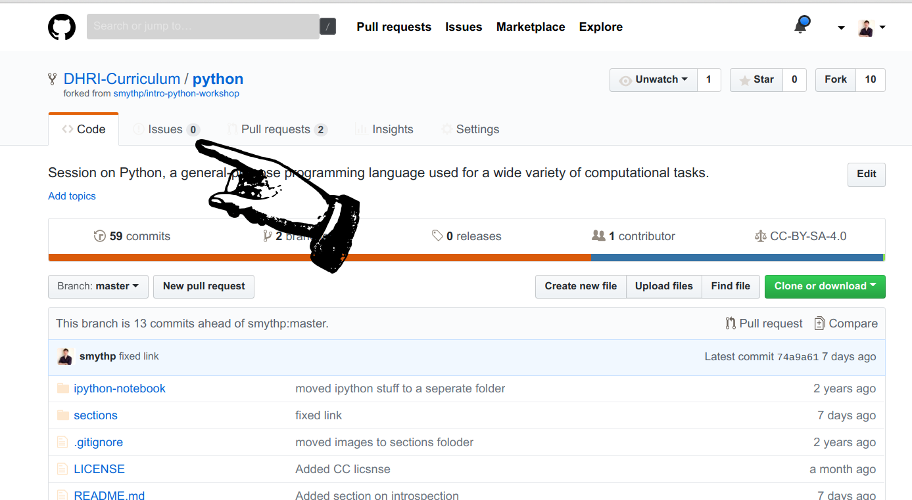
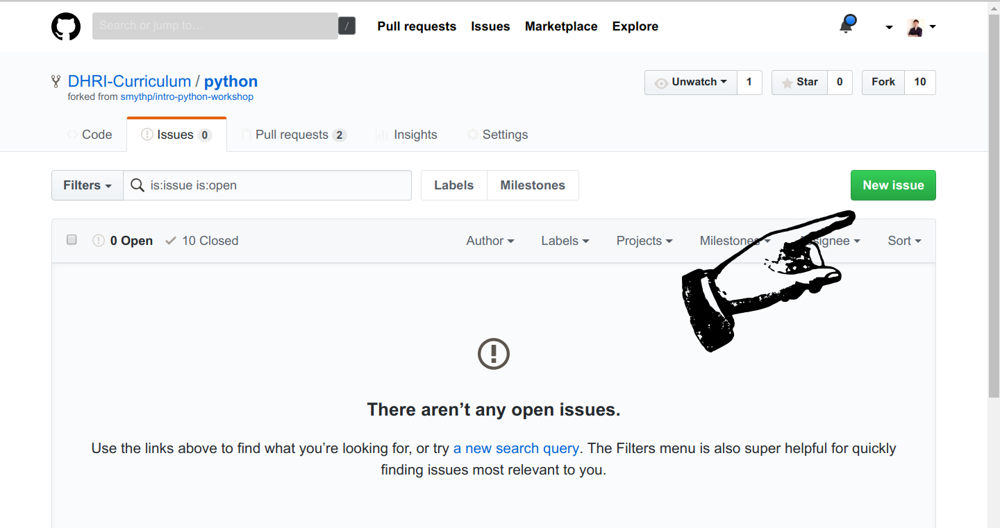

# Contributing to the curriculum

There are many ways to contribute back to the curriculum, from creating issues that suggest improvements to specific modules to creating entirely new sessions. This section describes various modes of interaction with the DHRI curriculum materials, including forking repositories to your account and creating issues and pull requests.

## Creating Issues

A critical and relatively accessible way to contribute back to the DHRI curriculum is to create an issue on GitHub. While reading DHRI curriculum on GitHub, you may encounter inconsistencies, typos, sections that need clarification, or typographical errors. When this happens, you can open an issue to let us know about the problem or potential improvement.

To open an issue, you must be in a GitHub repository. In the menu bar at the top center of the page, click the `Issues` tab.

.

After clicking the issues tab, yo will see a screen with the currently open issues, if any. To create a new issues, click the large green button on the right of the page.

On the New Issue page, there is only one required field—the issue title. However, consider leaving a detailed explanation of the issue, including which file you encountered it, if relevant. You can use markdown formatting in your in the body of your issue.

To clmplete your issue, click the green button labelled `Submit New Issue`.

![Image showing where the submit new issue button is. In the issue body box, the message reads "In loop.md, I noticed that the index of the example is flowers[1], which is not "rose" as the output indicates. Looks like it should be 0."](finish_new_issue.png).

## Forking

By deffault, you will not have access to directly modify repositories in the DHRI curriculum. 

## Creating a pull request

## Writing a new session
